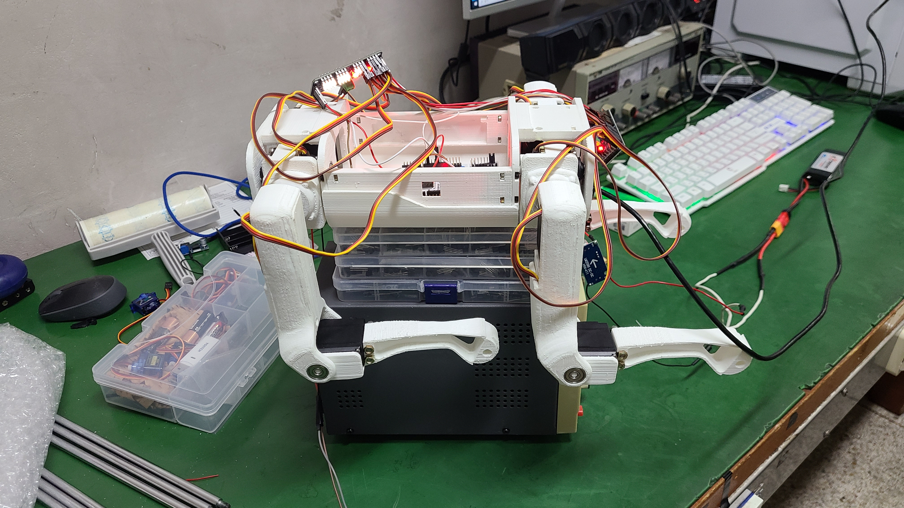
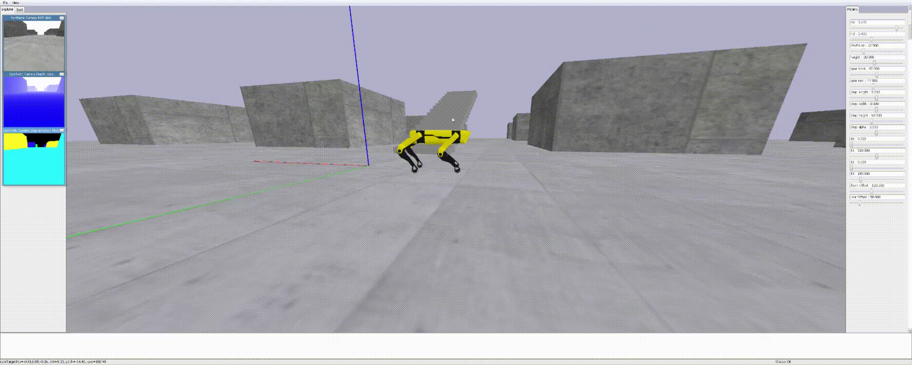
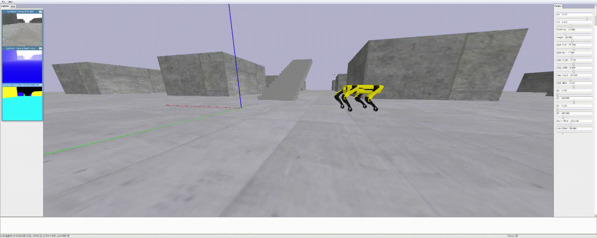
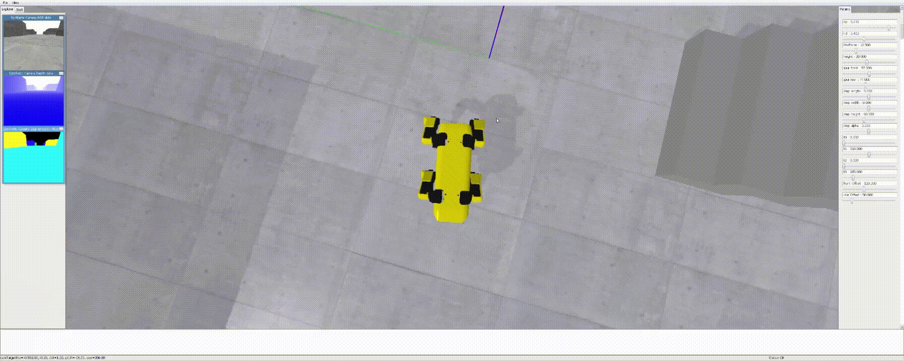

#  4족 보행 로봇 (Quadruped-Robot)

**4족 보행 로봇 프로젝트**는 STM32와 PCA9685 16채널 PWM 드라이버, MG995 서보모터를 이용해  
4족 보행 로봇의 **전진, 후진, 좌/우(측면) 이동** 기능을 구현한 프로젝트입니다.

---

##  프로젝트 개요

- **수행 기간**: 2024.07.23 ~ 2024.12.30  
- **사용 기술**:  
  - STM32  
  - C  
  - I2C 통신  
  - PWM 제어  
  - 파이썬 시뮬레이션

- **주요 기능**:  
  - STM32와 I2C로 서보모터 제어  
  - 4족 로봇 전진/후진/좌/우(측면) 이동 보행

---

##  기술 스택

| 기술  | 설명 |
|---|---|
|  | 4족 보행 로봇 메인 MCU |
|  | 보행 알고리즘 및 제어 로직 구현 |
|  | 로봇 보행 시뮬레이션 및 변수 효과 검증 |
|  | PCA9685 16채널 PWM 드라이버 제어 |


---

##  기능 설명

- **전진, 후진, 좌/우 이동**  
  - 각 다리의 보행 알고리즘을 통해 전진/후진 뿐만 아니라,  
    회전 없이 **왼쪽/오른쪽(측면) 이동**까지 구현하였습니다.
- **실시간 서보모터 각도 제어**  
  - STM32를 이용하여 I2C 통신을 통해  
    보행에 필요한 모든 서보모터의 각도를 **실시간으로 제어**합니다.
- **시뮬레이션 기반 변수 검증**  
  - 파이썬 시뮬레이션을 통해  
    **로봇의 보행 변수(속도, 보폭, 주기 등)**가 실제 움직임에  
    어떤 영향을 주는지 직접 확인하였습니다.
---

## 시스템 구성도


## **소스 코드**
### [소스코드 바로가기](src/)

##  **환경 구성 방법**

**STM32(HAL)** 에서 **I2C**로 **PCA9685 PWM 드라이버 2개** 를 제어하여 **서보 12개(각 다리 3축)** 를 구동합니다.  
작업은 **하드웨어 연결 → PCA9685 프리스케일러 설정 → 구동 전 각도 테스트 & 자세 보정 → 파라미터 튜닝** 순서로 진행됩니다.


---

## 1) 하드웨어 연결

- **STM32 ↔ PCA9685(I2C 통신 속도)**: 100 kHz 
- **PCA9685 PWM 주파수**: 50 Hz `PCA9685_Init(..., address, 50)`
- **보드당 채널 배치 (예시)**
  - `0x82` 보드: `채널 0~2` → *왼쪽 앞 다리 3개*
  - `0x82` 보드: `채널 3~5` → *오른쪽 앞 다리 3개*
  - `0x80` 보드: `채널 0~2` → *왼쪽 뒷 다리 3개*
  - `0x80` 보드: `채널 3~5` → *오른쪽 뒷 다리 3개*
- **배선 요약**
  - STM32 **I2C1** ↔ PCA9685×2 **SDA/SCL**
  - **VCC**(PCA9685 동작 전원): 3.3V
  - **V+**(서보 전원): 외부 전원(5~6V)
  - **GND 공통**: STM32, PCA9685, 서보 전원 **모두 공통 접지**

---

## 2) PCA9685_Prescale 초기화

```
  // 원하는 주파수만 넣으면 prescale 계산 → SLEEP → prescale write → RESTART로 동작
  PCA9685_Init(&hi2c1, slave_address, frequency);

  PCA9685_Init(&hi2c1, 0x80, 50); 
  PCA9685_Init(&hi2c1, 0x82, 50);

```

---

## 3) 각도 테스트 (초기 90° 위치 확인)

```
  // [0]~[2] : 왼쪽 앞 다리   
  PCA9685_SetServoAngle(&hi2c1, 0x82, 0, 90);
  PCA9685_SetServoAngle(&hi2c1, 0x82, 1, 90);
  PCA9685_SetServoAngle(&hi2c1, 0x82, 2, 90);

  // [3]~[5] : 오른쪽 앞 다리
  PCA9685_SetServoAngle(&hi2c1, 0x82, 3, 90);
	PCA9685_SetServoAngle(&hi2c1, 0x82, 4, 90);
	PCA9685_SetServoAngle(&hi2c1, 0x82, 5, 90);

  // [0]~[2] : 왼쪽 뒷 다리
	PCA9685_SetServoAngle(&hi2c1, 0x80, 0, 90);
	PCA9685_SetServoAngle(&hi2c1, 0x80, 1, 90);
	PCA9685_SetServoAngle(&hi2c1, 0x80, 2, 90);

  // [3]~[5] : 오른쪽 뒷 다리 
	PCA9685_SetServoAngle(&hi2c1, 0x80, 3, 90);
	PCA9685_SetServoAngle(&hi2c1, 0x80, 4, 90);
	PCA9685_SetServoAngle(&hi2c1, 0x80, 5, 90);
```

---

## 4-1) 초기 자세 보정 - 하드웨어
  - 브래킷/조립 오차를 보정하기 위해 각 관절의 기준각을 설정합니다.  
  - 모든 서보를 90°로 맞췄을 때 아래 이미지와 같은 기준 자세가 되어야 합니다.  
  - 기준 자세가 맞지 않으면 서보 브래킷 위치를 재조정하세요.
  

## 4-2) 초기 자세 보정 - 소프트웨어
```
  // [0]~[2] : 왼쪽 앞 다리 // [3]~[5] : 오른쪽 앞 다리 // [6]~[8] : 왼쪽 뒷 다리 // [9]~[11] : 오른쪽 뒷 다리
  // 오프셋 값을 조금씩 조절하며 초기 기준각을 보정합니다.
  double _servo_offsets[12] = { 180, 90, 90, 0, 90, 90, 180, 90, 90, 0 90, 90};
```

## 5) 보행 파라미터 튜닝
```
  double Sl = -30; // (−) 전진 , (+) 후진 
  double Sw = 0;   // (−) 좌, (+) 우 이동(사이드 스텝)
  double Sa = 0;   // (−) 우회전, (+) 좌회전
  double Sh = 40;  // 스윙 높이(발 들림)

  double t0 = 0;     // 발을 뒤로 당기기 전 대기
  double t1 = 1200;  // 발 뒤로 당기는 시간 
  double t2 = 500;   // 앞으로 당기기 전 대기
  double t3 = 100;   // 발 앞으로 당기는 시간

  // 현재는 코드의 변수 값을 직접 수정해 보행을 조절합니다.
```


##  **시연 영상**

###  [첫 동작](https://drive.google.com/file/d/1HjOwKQp8KJjVj2hTh6_adtx6zlYOwu_e/view?usp=sharing)  


###  [전진](https://drive.google.com/file/d/1SwbQgumZ2qXSB3PdyCzM1mTH8wKag_9B/view?usp=sharing)  


###  [후진](https://drive.google.com/file/d/1MgpPF4JHcQ8GS_9CZfato3qhq4KthBys/view?usp=sharing)


### [좌 이동](https://drive.google.com/file/d/1ZpJAempI7OCzLiTSKFfvauY5EdH2y3WN/view?usp=sharing)


### [우 이동](https://drive.google.com/file/d/1yQKBVOaO4YPHyf00HGkSakdziHmvaDI0/view?usp=sharing)


### [시뮬레이션_전진](https://drive.google.com/file/d/1HZt_TObTcKbMdISfTRditi58DKzvqbiY/view?usp=sharing)


### [시뮬레이션_후진](https://drive.google.com/file/d/1LnhFEd_Xjx05ZimlWcwkzKiw22vxL323/view?usp=sharing)


### [시뮬레이션_회전](https://drive.google.com/file/d/16oX-1kpdu3OMaDYZPiLPynQYnGS3Siz-/view?usp=sharing)



## **트러블 슈팅**

### 1) 역변환 행렬(Inv-T)을 하드코딩으로 처리
- **문제**: C에서 역행렬 계산을 직접 구현하기 어려웠음.
- **해결**: 각 다리 좌표 변환을 **고정된(하드코딩) 역행렬 값**으로 처리함.  

---

### 2) IMU가 없어 몸체 자세 보정이 부족함
- **문제**: 평지 직진 중에도 **조금씩 좌/우로 밀림**(드리프트)이 생김. 바닥 상태나 서보 편차에 따라 **수평/방향 유지**가 불안정함.
- **향후 개선**: **6축/9축 IMU**를 달아 롤/피치/요(자세)를 추정하고, 그 값을 이용해 **실시간으로 자세를 보정**한다.


---


## **참고 문헌**

### [참고 영상](https://youtu.be/XBYq_FJbdTk?si=Gbbtj9yYs3oxuCF6)
### [참고 소스 코드](https://github.com/Road-Balance/SpotMicroJetson)
### [데이터시트_PCA9685](https://www.alldatasheet.co.kr/datasheet-pdf/view/750522/PHILIPS/PCA9685.html)
### [데이터시트_MG995](https://www.alldatasheet.co.kr/datasheet-pdf/view/1132435/ETC2/MG995.html)